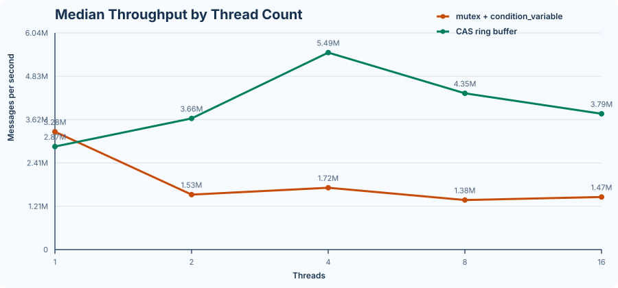
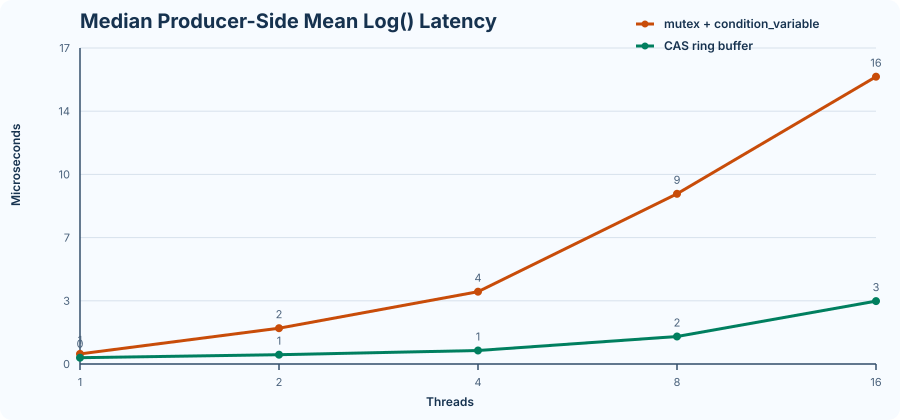
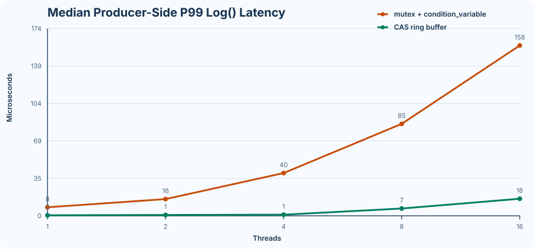
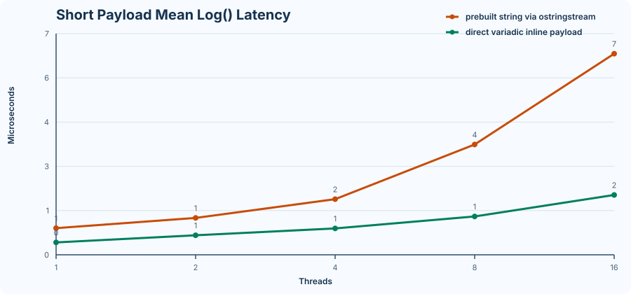
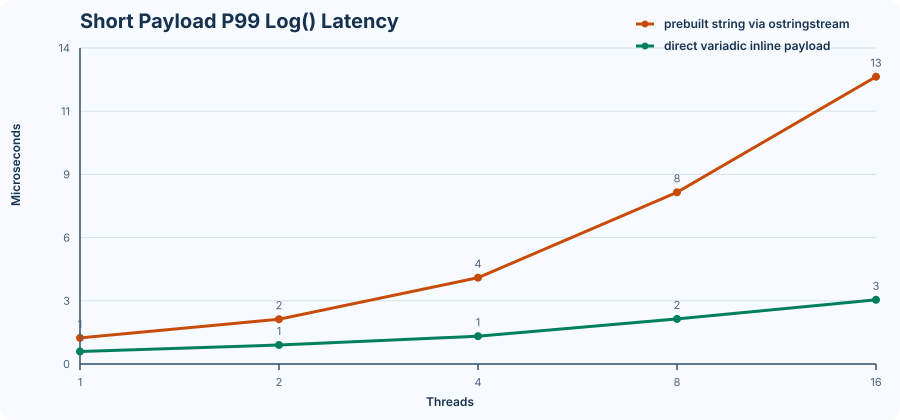
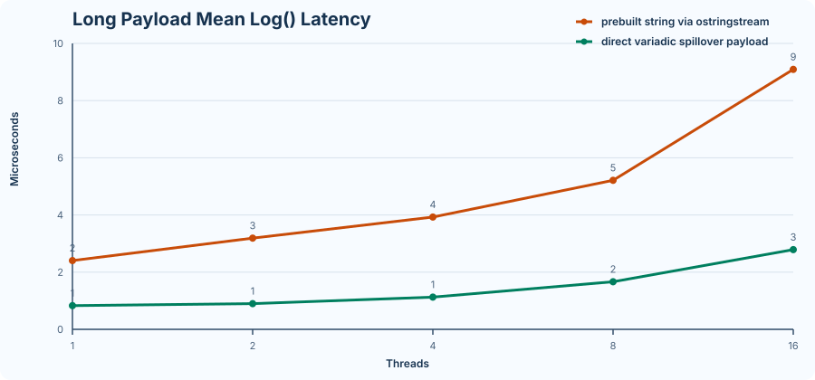
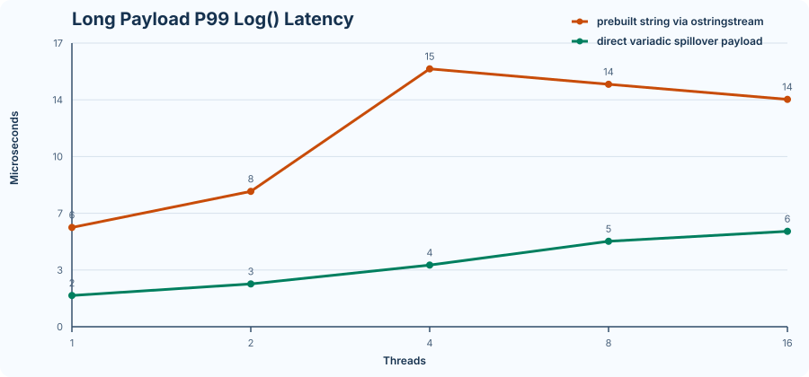
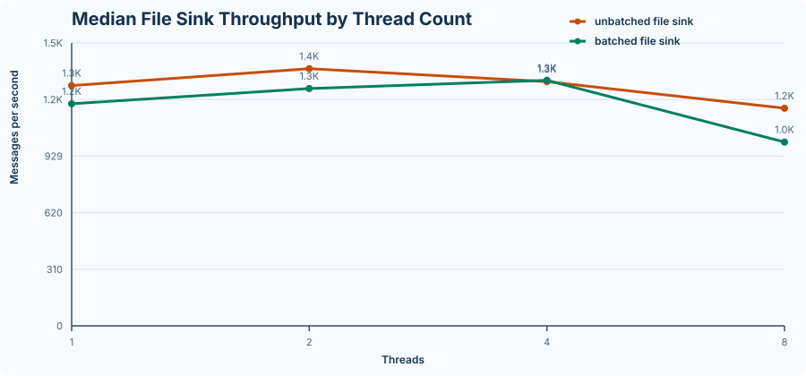

# Benchmark Report

Generated at `2026-05-07 13:53:09` by [`scripts/generate_benchmark_report.py`](../scripts/generate_benchmark_report.py).

## Methodology

- Compare target: `./build/hlog_compare_benchmark`
- Latency target: `./build/hlog_latency_benchmark`
- Payload target: `./build/hlog_payload_benchmark`
- File sink target: `./build/hlog_file_sink_benchmark`
- Thread counts: `1, 2, 4, 8, 16`
- File sink thread counts: `1, 2, 4, 8`
- Messages per thread: `20000`
- File sink messages per thread: `1000`
- Warm-up rounds: `1`
- Measured rounds: `5`
- File sink warm-up rounds: `0`
- File sink measured rounds: `2`
- Compare / latency / payload targets use an in-memory counting sink to isolate queueing and synchronization costs from disk I/O
- File sink target uses the real `hlog::FileSink` path and includes filesystem effects

## Environment

- System: `Darwin`
- Platform: `macOS-14.7.2-x86_64-i386-64bit-Mach-O`
- Machine: `x86_64`
- Hardware model: `MacBookPro15,1`
- CPU: `Intel Core i7 @ 2.2 GHz`
- Hardware threads: `12`
- Memory: `16 GB`
- Compiler: `Apple clang version 16.0.0 (clang-1600.0.26.6)`
- Compiler path: `/usr/bin/c++`
- Build type: `Release`
- CMake generator: `Unix Makefiles`
- Build flags: `-O3 -DNDEBUG`

## Throughput

| Threads | `mutex + condition_variable` | `CAS` ring buffer | Improvement |
| --- | ---: | ---: | ---: |
| 1 | `3.28e6` | `2.87e6` | `-12.5%` |
| 2 | `1.53e6` | `3.66e6` | `138.5%` |
| 4 | `1.72e6` | `5.49e6` | `218.6%` |
| 8 | `1.38e6` | `4.35e6` | `215.4%` |
| 16 | `1.47e6` | `3.79e6` | `158.3%` |

Raw CSV: [docs/perf/throughput.csv](perf/throughput.csv)

## Producer-Side Mean Latency

## Producer-Side P99 Latency

| Threads | Mutex mean (`us`) | CAS mean (`us`) | Mutex p95 (`us`) | CAS p95 (`us`) | Mutex p99 (`us`) | CAS p99 (`us`) |
| --- | ---: | ---: | ---: | ---: | ---: | ---: |
| 1 | `0.56` | `0.35` | `6.22` | `0.43` | `7.94` | `0.50` |
| 2 | `1.98` | `0.51` | `9.78` | `0.65` | `15.51` | `0.75` |
| 4 | `3.99` | `0.74` | `20.89` | `0.91` | `39.65` | `1.07` |
| 8 | `9.40` | `1.52` | `47.58` | `3.17` | `85.27` | `6.78` |
| 16 | `15.87` | `3.48` | `83.49` | `5.21` | `157.89` | `15.85` |

Raw CSV: [docs/perf/latency.csv](perf/latency.csv)

## Payload Hot Path

This section keeps the same `hlog::AsyncLogger` and the same in-memory sink, and changes only how the producer builds the payload:

- `prebuilt_*`: build a `std::string` with `std::ostringstream` before calling `Info()`, approximating the previous hot path.
- `variadic_short`: call `Info("thread=", tid, " seq=", index)` directly; the common-case payload stays within `LogPayload` inline storage.
- `variadic_long`: call `Info(..., " payload=", <512B blob>)` directly; the payload exceeds inline storage and exercises spillover.

### Short Payload Mean Latency

### Short Payload P99 Latency

| Threads | Prebuilt mean (`us`) | Variadic mean (`us`) | Mean improvement | Prebuilt p99 (`us`) | Variadic p99 (`us`) | P99 improvement |
| --- | ---: | ---: | ---: | ---: | ---: | ---: |
| 1 | `0.86` | `0.40` | `53.5%` | `1.17` | `0.56` | `52.2%` |
| 2 | `1.19` | `0.63` | `47.2%` | `2.01` | `0.85` | `57.5%` |
| 4 | `1.80` | `0.85` | `52.6%` | `3.87` | `1.25` | `67.8%` |
| 8 | `3.57` | `1.24` | `65.2%` | `7.71` | `2.03` | `73.7%` |
| 16 | `6.50` | `1.94` | `70.2%` | `12.90` | `2.88` | `77.6%` |

### Long Payload Mean Latency

### Long Payload P99 Latency

| Threads | Prebuilt mean (`us`) | Variadic mean (`us`) | Mean improvement | Prebuilt p99 (`us`) | Variadic p99 (`us`) | P99 improvement |
| --- | ---: | ---: | ---: | ---: | ---: | ---: |
| 1 | `2.33` | `0.80` | `65.6%` | `5.93` | `1.87` | `68.5%` |
| 2 | `3.09` | `0.87` | `71.8%` | `8.09` | `2.56` | `68.3%` |
| 4 | `3.81` | `1.09` | `71.3%` | `15.40` | `3.69` | `76.1%` |
| 8 | `5.05` | `1.61` | `68.1%` | `14.48` | `5.11` | `64.8%` |
| 16 | `8.81` | `2.70` | `69.3%` | `13.58` | `5.70` | `58.0%` |

Raw CSV: [docs/perf/payload-latency.csv](perf/payload-latency.csv)

## File Sink Throughput

This section uses the real `FileSink` path rather than the in-memory counting sink, and compares:

- `unbatched_file_sink`: `max_batch_size=1`, approximating per-message file writes.
- `batched_file_sink`: `max_batch_size=64 KiB` and `flush_interval=250 ms`, which batches multiple formatted log lines into one contiguous write.

Because this benchmark includes actual filesystem behavior, it is noisier than the in-memory queue benchmarks and should be interpreted as a local-machine systems optimization signal rather than a portable absolute number.

| Threads | Unbatched file sink | Batched file sink | Improvement |
| --- | ---: | ---: | ---: |
| 1 | `1.32e3` | `1.22e3` | `-7.5%` |
| 2 | `1.41e3` | `1.30e3` | `-7.7%` |
| 4 | `1.34e3` | `1.34e3` | `0.6%` |
| 8 | `1.19e3` | `1.01e3` | `-15.5%` |

Raw CSV: [docs/perf/file-sink-throughput.csv](perf/file-sink-throughput.csv)

## Notes

- The latency benchmark wraps only the producer-side `Log()` call, so it reflects direct caller overhead rather than end-to-end flush latency.
- The measurements include `steady_clock` sampling cost; treat them as relative comparisons rather than absolute instruction-level timings.
- Because the report uses medians over multiple rounds, it is more stable than quoting a single best run from the README.
- The single-thread case may still favor the mutex baseline, because there is no contention yet and the lock-free bookkeeping has a fixed overhead. The lock-free advantage appears once producer contention becomes the bottleneck.
- The payload benchmark is not a mutex-vs-lock-free comparison; it is a same-logger A/B test for producer-side payload construction overhead.
- The file sink benchmark is intentionally a separate section, because it mixes queueing, formatting, filesystem buffering, and storage behavior; it answers a different question from the in-memory sink benchmarks.
